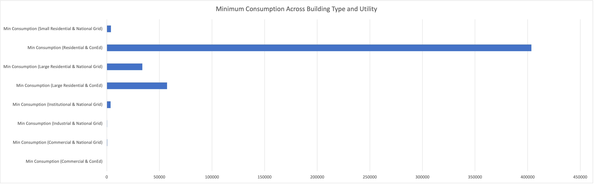
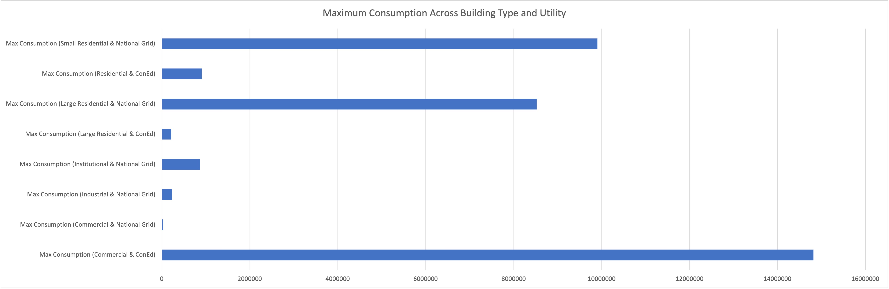
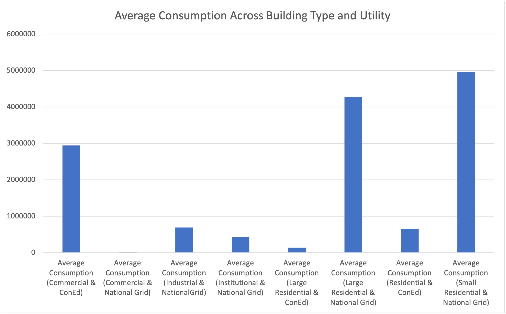
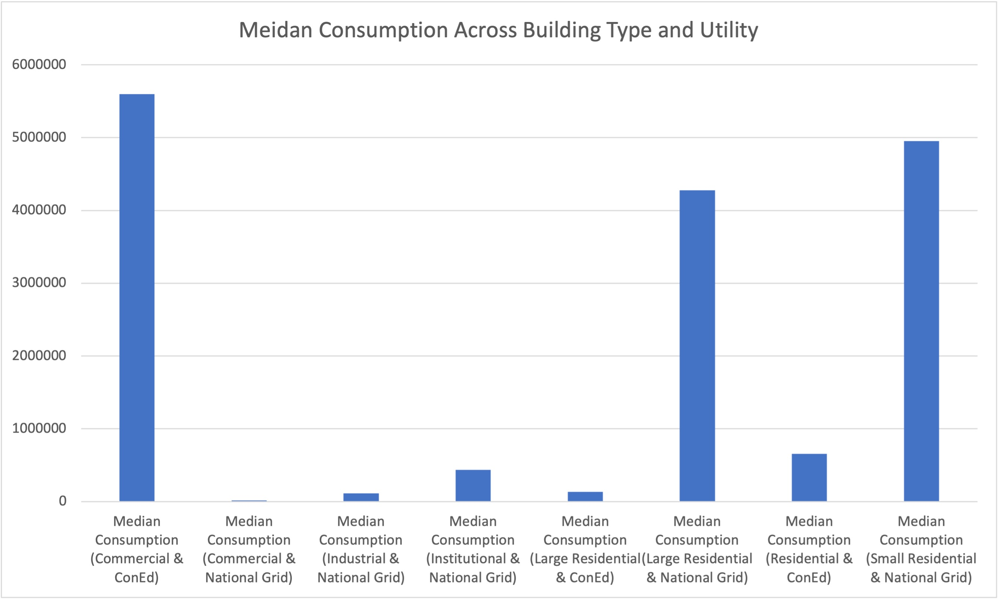

# Data Set Details 

## Data Sources

### The origin of my dataset
- [Natural Gas Consumption by ZIP Code - 2010](https://data.cityofnewyork.us/Environment/Natural-Gas-Consumption-by-ZIP-Code-2010/uedp-fegm/about_data)
### The original raw data (CSV)
- [Raw data](./data/raw_data.csv)
### Munged data file (CSV)
- [Clean data](./data/clean_data.csv)
### Spreadsheet including the formulas and charts
- [Clean data excel](./data/Clean_data.xlsx)

## The first 20 rows from the original data file

| Zip Code | Building type (service class  | Consumption (therms) | Consumption (GJ) | Utility/Data Source |
|----------|-------------------------------|----------------------|------------------|---------------------|
| 10300    | Commercial                    | 470                  | 50               | National Grid       |
| 10335    | Commercial                    | 647                  | 68               | National Grid       |
| 10360    | Large residential             | 33762                | 3562             | National Grid       |
| 11200    | Commercial                    | 32125                | 3389             | National Grid       |
| 11200    | Institutional                 | 3605                 | 380              | National Grid       |
| 11200    | Small residential             | 3960                 | 418              | National Grid       |
| 11254    | Small residential             | 1896                 | 200              | National Grid       |
| 11274    | Commercial                    | 8364                 | 882              | National Grid       |
| 11279    | Commercial                    | 2579                 | 272              | National Grid       |
| 11279    | Large residential             | 301                  | 32               | National Grid       |
| 11303    | Commercial                    | 13039                | 1376             | National Grid       |
| 11303    | Small residential             | 3009                 | 317              | National Grid       |
| 11313    | Small residential             | 3488                 | 368              | National Grid       |
| 11314    | Small residential             | 6011                 | 634              | National Grid       |
| 11315    | Commercial                    | 8520                 | 899              | National Grid       |
| 11315    | Institutional                 | 339                  | 36               | National Grid       |
| 11315    | Large residential             | 335091               | 35354            | National Grid       |
| 11315    | Small residential             | 4458                 | 470              | National Grid       |
| 11323    | Commercial                    | 3637                 | 384              | National Grid       |
| 11332    | Commercial                    | 3795                 | 400              | National Grid       |

## Data Munging Process

1. The third column and the fourth column are actually the same measurements except for the units. Therefore, I decided to delete the fourth column.
    > | Zip Code | Building type (service class  | Consumption (therms) | Consumption (GJ) | Utility/Data Source |
    > |----------|-------------------------------|----------------------|------------------|---------------------|
    - how I remove the header of the fourth column [ **Consumption (GJ)** ]
    ``` 
    header.pop(3)
    ``` 
    - how I remove the rest of the fourth column [ **Consumption (GJ)** ]
    ``` 
    row.pop(3)
    ``` 

2. There are some missing values, so I chose to remove them so that my analysis is correct.
    > | Zip Code | Building type (service class  | Consumption (therms) | Consumption (GJ) | Utility/Data Source |
    > |----------|-------------------------------|----------------------|------------------|---------------------|
    > | 11335    | Large residential             |                      |                  | National Grid       |
    ```
    if row[2] != '':  # remove missing values
            processed_data.append(row)
    ```

3. In the raw data file, some values in the first column [ **Zip Code** ] not only include the zip code information, but also include the specific latitude and longitude. To standardize the format of the first column, I only kept the first five characters of the values in the first column.
    > | Zip Code                                 | Building type (service class  | Consumption (therms) | Consumption (GJ) | Utility/Data Source |
    > |------------------------------------------|-------------------------------|----------------------|------------------| --------------------|
    > | 11420(40.673345242689, -73.817707171649) | Small residential             | 9694601              | 1022835          | National Grid       |
    ```
    for row in reader:
        row[0] = row[0][:5]
    ```

4. To better analyze the data, I sorted the data based on different building types and utilities.
    ```
    sorted_data = sorted(processed_data, key = lambda x: (x[1], x[3]))
    ```

# Analysis

## Aggregate Statistics

For my dataset, I chose to calculate mean, median, minimum, and maximum. Mean 2010 natural gas consumption for NYC is 2750243.658 therms, median 2010 natural gas consumption for NYC is 1165816 therms, minimum 2010 natural gas consumption for NYC is 1 therm, and maximum 2010 natural gas consumption for NYC is 42747652 therms. 
Since the data is collected based on different utilities, I believe that minimum and maximum might not be very useful statistics since buildings may freely switch between two different providers. Only consuming 1 therm does not imply that there is no one living here, and using 42747652 therms also does not mean the building per capita usage is high. When it comes to average, it also might be affected greatly by the outliers, such as the minimum 1 therm, which decreases its reliability. Therefore, median here would be the best statistical indicator.

## Aggregate statistics with conditions

To better compare natural gas consumption, I created seperate statistics for different building types (_Commercial, Industrial, Institutional, Large Residential, Residential, Small Residential_) and utilities(_ConEd and National Grid_). 



From the chart, we can tell that residential buildings, regardless of their sizes, have the highest three minimum consumption. This makes sense because residential buildings are likely always to be occupied, while other buildings such as factories and schools might use gas on a more seasonal basis.



Different from the minimum chart, commercial buildings have the highest natural gas usage. Commercial establishments often use equipment and machinery that require significant amounts of energy such as commercial kitchen equipment in restaurants. Hence, it makes sense why commercial buildings use the most energy. However, maximum industrial building energy-consumption is not as high as I expected. I thought some specialized factories, such as metal manufacturing, have inherently energy-intensive processes.



Similar to the findings from the minimum chart, residential buildings have higher average natural gas consumption. Building types like commercial might be influenced by some untenanted buildings.



Observing the median chart, it corresponds to the result in the maximum chart. Even though more people might be active in residential buildings on average, commercial buildings typically have larger size and scale, higher heating and cooling needs, and more equipments that generally consume more energy.  


